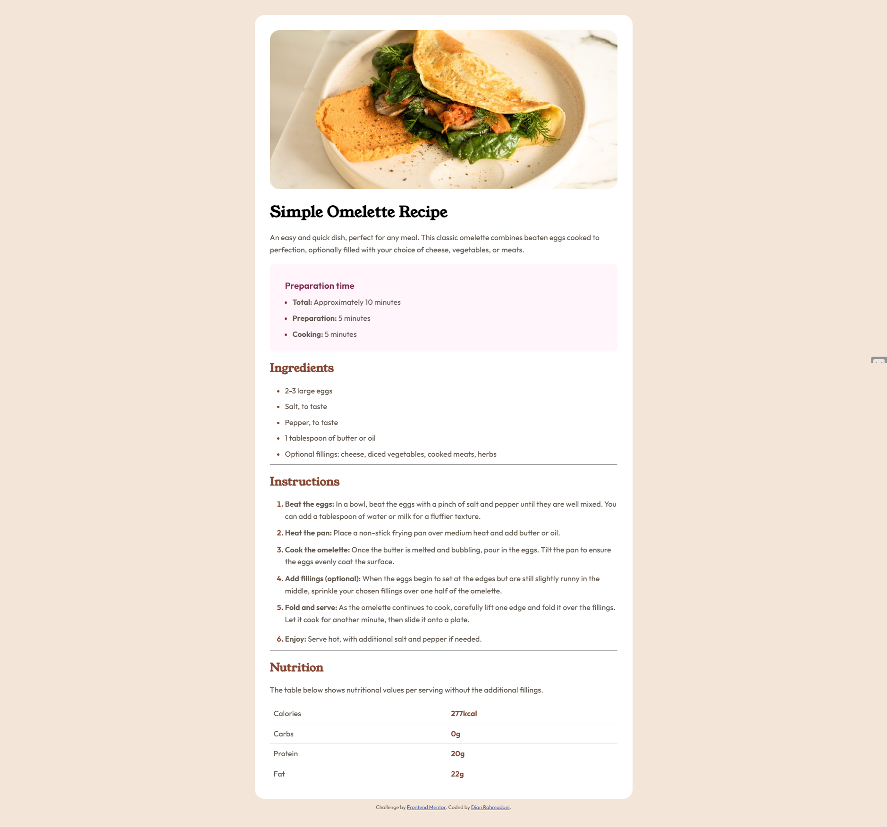

# Frontend Mentor - Recipe page solution

This is a solution to the [Recipe page challenge on Frontend Mentor](https://www.frontendmentor.io/challenges/recipe-page-KiTsR8QQKm). Frontend Mentor challenges help you improve your coding skills by building realistic projects. 

## Table of contents

- [Overview](#overview)
  - [Screenshot](#screenshot)
  - [Links](#links)
- [My process](#my-process)
  - [Built with](#built-with)
  - [What I learned](#what-i-learned)
- [Author](#author)

## Overview

### Screenshot



### Links

- Solution URL: [https://github.com/madiajijah11/recipe-page](https://github.com/madiajijah11/recipe-page)
- Live Site URL: [https://madiajijah11.github.io/recipe-page](https://madiajijah11.github.io/recipe-page)

## My process

### Built with

- Semantic HTML5 markup
- CSS custom properties
- Flexbox
- Mobile-first workflow

### What I learned

Use this section to recap over some of your major learnings while working through this project. Writing these out and providing code samples of areas you want to highlight is a great way to reinforce your own knowledge.

To see how you can add code snippets, see below:

```html
   <div class="container">
      
      <div class="introductions">
        <h1>Simple Omelette Recipe</h1>
        <p>
          An easy and quick dish, perfect for any meal. This classic omelette
          combines beaten eggs cooked to perfection, optionally filled with your
          choice of cheese, vegetables, or meats.
        </p>
        <div class="preparation">
          <h3>Preparation time</h3>
          <ul>
            <li><b>Total:</b> Approximately 10 minutes</li>
            <li><b>Preparation:</b> 5 minutes</li>
            <li><b>Cooking:</b> 5 minutes</li>
          </ul>
        </div>
      </div>
      <div class="ingredients">
        <h2>Ingredients</h2>
        <ul>
          <li>2-3 large eggs</li>
          <li>Salt, to taste</li>
          <li>Pepper, to taste</li>
          <li>1 tablespoon of butter or oil</li>
          <li>
            Optional fillings: cheese, diced vegetables, cooked meats, herbs
          </li>
        </ul>
      </div>
      <hr />
      <div class="instructions">
        <h2>Instructions</h2>
        <ol class="instructions-list">
          <li>
            <b>Beat the eggs:</b> In a bowl, beat the eggs with a pinch of salt
            and pepper until they are well mixed. You can add a tablespoon of
            water or milk for a fluffier texture.
          </li>
          <li>
            <b>Heat the pan:</b> Place a non-stick frying pan over medium heat
            and add butter or oil.
          </li>
          <li>
            <b>Cook the omelette:</b> Once the butter is melted and bubbling,
            pour in the eggs. Tilt the pan to ensure the eggs evenly coat the
            surface.
          </li>
          <li>
            <b>Add fillings (optional):</b> When the eggs begin to set at the
            edges but are still slightly runny in the middle, sprinkle your
            chosen fillings over one half of the omelette.
          </li>
          <li>
            <p>
              <b>Fold and serve:</b>
              As the omelette continues to cook, carefully lift one edge and
              fold it over the fillings. Let it cook for another minute, then
              slide it onto a plate.
            </p>
          </li>
          <li>
            <b>Enjoy:</b> Serve hot, with additional salt and pepper if needed.
          </li>
        </ol>
      </div>
      <hr />
      <div class="nutrition">
        <h2>Nutrition</h2>
        <p>
          The table below shows nutritional values per serving without the
          additional fillings.
        </p>
        <table>
          <tbody>
            <tr>
              <td>Calories</td>
              <td><b>277kcal</b></td>
            </tr>
            <tr>
              <td>Carbs</td>
              <td><b>0g</b></td>
            </tr>
            <tr>
              <td>Protein</td>
              <td><b>20g</b></td>
            </tr>
            <tr>
              <td>Fat</td>
              <td><b>22g</b></td>
            </tr>
          </tbody>
        </table>
      </div>
    </div>
```
```css
  @font-face {
    font-family: "Young Serif";
    src: url("assets/fonts/young-serif/YoungSerif-Regular.ttf");
  }

  @font-face {
    font-family: "Outfit";
    src: url("assets/fonts/outfit/Outfit-VariableFont_wght.ttf");
  }

  :root {
    --Nutmeg: hsl(14, 45%, 36%);
    --DarkRaspberry: hsl(332, 51%, 32%);
    --White: hsl(0, 0%, 100%);
    --RoseWhite: hsl(322, 100%, 98%);
    --Eggshell: hsl(29, 53%, 90%);
    --LightGrey: hsl(30, 18%, 87%);
    --WengeBrown: hsl(30, 10%, 34%);
    --DarkCharcoal: hsl(24, 5%, 18%);
    --YoungSerif: "Young Serif", serif;
    --Outfit: "Outfit", sans-serif;
  }

  * {
    box-sizing: border-box;
    padding: 0;
    margin: 0;
  }

  body {
    font-family: var(--Outfit);
    background-color: var(--Eggshell);
    line-height: 1.6;
    padding: 2rem;
    font-size: 16px;
    color: var(--WengeBrown);
    display: flex;
    justify-content: center;
    align-items: center;
    flex-direction: column;
    font-weight: 500;
  }

  p {
    margin-bottom: 1rem;
  }

  h1,
  h2 {
    font-family: var(--YoungSerif);
    font-weight: bold;
    margin-top: 1rem;
    margin-bottom: 0.5rem;
    padding-bottom: 0.5rem;
  }

  h1 {
    color: black;
  }

  h2 {
    color: var(--Nutmeg);
  }

  h3 {
    color: var(--DarkRaspberry);
    font-weight: bold;
    margin: 1rem;
    margin-bottom: 0.5rem;
  }

  .container {
    background-color: var(--White);
    max-width: 800px;
    margin: 0 auto;
    overflow: hidden;
    border-radius: 20px;
    padding: 2rem;
  }

  img {
    width: 100%;
    border-radius: 20px;
    height: auto;
  }

  .preparation {
    background-color: var(--RoseWhite);
    padding: 1rem;
    border-radius: 10px;
  }

  .preparation li::marker {
    color: var(--DarkRaspberry);
  }

  .ingredients li::marker {
    color: var(--Nutmeg);
  }

  .instructions-list {
    list-style-position: outside;
  }

  .instructions-list li {
    margin-bottom: 10px;
  }

  .instructions-list li::marker {
    color: var(--Nutmeg);
    font-weight: bold;
  }

  ul,
  ol {
    padding-left: 2rem;
  }

  li {
    margin-bottom: 0.5rem;
  }

  table {
    width: 100%;
    border-collapse: collapse;
  }

  tr {
    border-bottom: 1px solid var(--LightGrey);
  }

  tr:last-child {
    border-bottom: none;
  }

  td > b {
    color: var(--Nutmeg);
  }

  th,
  td {
    padding: 0.5rem;
    text-align: left;
  }

  .attribution {
    font-size: 11px;
    text-align: center;
    margin-top: 10px;
  }

  .attribution a {
    color: hsl(228, 45%, 44%);
  }

  /* Mobile Styles */
  @media only screen and (max-width: 375px) {
    body {
      padding: 0;
    }

    .container {
      border-radius: 0;
      padding: 0;
    }

    img {
      border-radius: 0;
    }

    .introductions {
      padding: 2rem;
    }

    .introductions h1 {
      margin-top: 0;
      line-height: 1;
    }

    .ingredients {
      padding: 2rem;
    }

    .instructions {
      padding: 2rem;
    }

    .nutrition {
      padding: 2rem;
    }
  }
```

## Author

- Website - [Dian Rahmadani](https://dian-rhmdni-portfolio.netlify.app)
- Frontend Mentor - [@madiajijah11](https://www.frontendmentor.io/profile/madiajijah11)
- Twitter - [@madiajijah11](https://www.twitter.com/madiajijah11)
